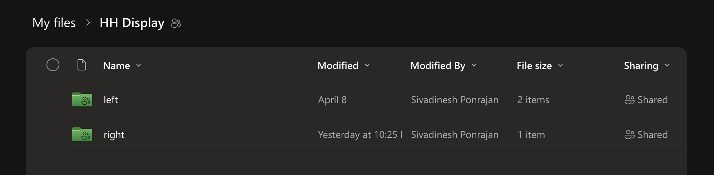
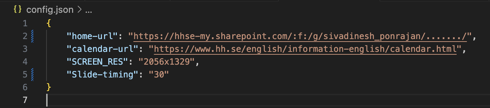

# 🎓 CampusPulse

CampusPulse - University community connected with everyday announcements, events, and updates - all in one dynamic display.

## 📋 Prerequisites

- Raspberry Pi with 64-bit OS image installed
- Internet connection
- SharePoint folder setup with proper structure
- Supports JPG/JPEG/PNG/PDF files to display.

## 🚀 Installation Guide

### 1. Download the repository

```bash
cd Desktop
git clone https://github.com/SivadineshPonrajan/campuspulse.git
cd campuspulse
```

### 2. Install the dependencies

```bash
chmod +x *.sh
./fontinstall.sh  # Install font for the calendar
sudo ./setup.sh
```

### 3. Set up Python environment & install requirements

```bash
python -m venv ~/.campuspulse
source ~/.campuspulse/bin/activate
python -m pip install --upgrade pip
pip install -r requirements.txt --no-input
```

### 4. Configure the SharePoint folder

- Create two folders named `left` and `right` inside your SharePoint folder
- Add content to display on the left side to the "left" folder
- Add content to display on the right side to the "right" folder



- Set the SharePoint folder sharing permission to `"Anyone with the link"`
- Add your SharePoint URL to the `home-url` field in the `config.json` file
- Customize slide timings in the `config.json` file if needed.



### 5. Create an autostart script

```bash
mkdir -p ~/.config/autostart/
nano ~/.config/autostart/campuspulse.desktop
```

Copy and paste the following into the file and add the path in Exec:
```bash
[Desktop Entry]
Version=1.0
Type=Application
Name=CampusPulse
Exec=/home/$(ls /home | head -n 1)/Desktop/campuspulse/start.sh
X-GNOME-Autostart-enabled=true
```

```bash
chmod +x ~/.config/autostart/campuspulse.desktop
```

### 6. Reboot the system

```bash
sudo reboot
```

Voilaaa... You are done! 🎉

## 🛠️ Working

- `main.py` is the main file that downloads the folders from SharePoint and displays.
- The files to be displayed should be in the form of images as `jpg/jpeg/png` or `PDF`.
- Scrapes the events from the public HH calendar and creates an image.
- Creates a combination of images and starts the slideshow.
- Every 12 hours, it redownloads the new files and scrapes the calendar.
- The script will automatically start running on system start or reboot.

**MAKE SURE THE RPI IS CONNECTED TO THE INTERNET!!!**

If something goes wrong or an error occurs, just reboot or restart.

(Still not resolvable? Feel free to contact me 🙂)

## 🧑‍💻 Developer Guide

```bash
➜  CampusPulse git:(main) ✗ tree
.
├── fontinstall.sh  # Shell file to install font for calendar
├── setup.sh        # Linux packages installation
├── start.sh        # Shell file to run the main program exec
├── config.json     # Config file for SharePoint URL and each slide timing
|
├── downloader.py   # Code to download the files from SharePoint
├── hhcalendar.py   # Code to scrape the HH English calendar and make an image
├── composite.py    # Create combinations of images with the docs
├── main.py         # Main code
|
├── requirements.txt # Python packages requirements file
|
├── images          # Folder with documentation images
│   └── *.png
├── home            # Folder with homepage
│   └── home.png
```
